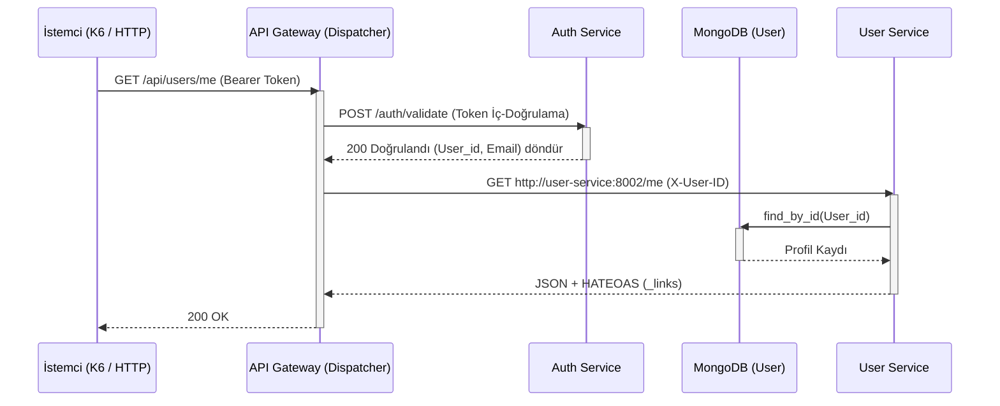
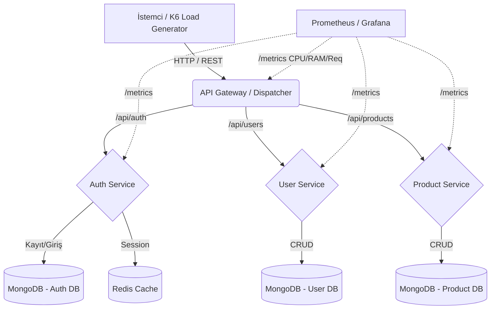
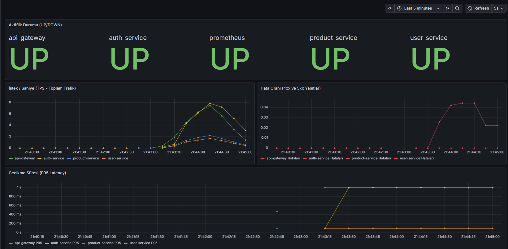

# 🚀 API Gateway & Microservices Ecosystem Proje Raporu

**Proje Adı:** Gelişmiş API Gateway ve Mikroservis Mimarisi Entegrasyonu  
**Kurum:** Kocaeli Üniversitesi Bilişim Sistemleri Mühendisliği  
**Ders:** Yazılım Laboratuvarı-II  
**Ekip Üyeleri:** Boran Sert, Göksel  
**Tarih:** 5 Nisan 2026

---

## 1. Problemin Tanımı ve Amaç (Giriş)

Günümüz modern web uygulamaları, artan trafik ve çeşitlenen iş yükleri sebebiyle monolitik (tek parça) mimarilerden mikroservis (dağıtık) mimarilere geçiş yapmaktadır. Ancak mikroservis mimarisine geçiş, beraberinde ağ yönetimi, yetkilendirme (authorization), yük dengeleme (load balancing) ve izlenebilirlik (monitoring) gibi kompleks problemler getirir. İstemcilerin her bir mikroservise doğrudan ulaşması, hem güvenlik açıkları doğurur hem de yönetilebilirliği zorlaştırır.

**Projenin Amacı:**
Bu proje, bağımsız ve odaklanmış mikroservislerin (Authentication, User, Product), dış dünyaya tek bir merkezden (**API Gateway / Dispatcher**) kontrollü, güvenli ve izlenebilir bir şekilde açılmasını sağlayan bir ekosistem geliştirmeyi amaçlamaktadır. Aynı zamanda sistem; SOLID prensipleri, HATEOAS (Richardson Olgunluk Modeli Seviye 3) uyumluluğu ve Prometheus/Grafana telemetri altyapısıyla desteklenerek endüstri standartlarında ölçeklenebilir bir yapı sunmaktadır.

---

## 2. Tasarım, Mikroservisler ve Teorik Altyapı

### RESTful Servisler ve Richardson Olgunluk Modeli
REST (Representational State Transfer), web hizmetleri arası iletişimde HTTP protokolünün standartlarını kullanan mimari bir yaklaşımdır. Leonard Richardson tarafından geliştirilen Olgunluk Modeli (Maturity Model), bir API'nin ne kadar "RESTful" olduğunu 4 seviyede inceler:

*   **Seviye 0 (The Swamp of POX):** Sadece HTTP üzerinden veri taşınır. URL ve Metotlar anlamlı kullanılmaz.
*   **Seviye 1 (Resources):** Her veri bir kaynağa (URL) bağlanır (örn. `/products`).
*   **Seviye 2 (HTTP Verbs):** HTTP metotları (GET, POST, PUT, DELETE) ve durum kodları (200, 404, 500) amacına uygun kullanılır.
*   **Seviye 3 (Hypermedia Controls - HATEOAS):** İstemci, API'nin döndürdüğü yanıt içerisindeki `_links` gibi bağlantılar üzerinden uygulamada yapabileceği bir sonraki adımları (State) dinamik olarak öğrenir.

**Projedeki Uygulaması:**
Projemizdeki `ProductService` ve `UserService` tamamen **Seviye 3 (HATEOAS)** yapısında geliştirilmiştir. Her yanıt, istemciye yönlendirme yapacak `_links` (self, update, collection) barındırmaktadır.

### Algoritma ve Karmaşıklık Analizi
*   **Gateway Rota Eşleştirme (Route Matching):** Dispatcher'a gelen isteklerin hedefini bulmak için YAML üzerinden rotalar uzunluğa göre sıralanır (`sorted_routes`). Karmaşıklık: Kıyaslamalar için **$O(E_m)$** (E=Rota sayısı). Hash-map (O(1)) tabanlı yapılarak optimize edilebilir.
*   **Veritabanı Okuma/Yazma:** MongoDB'de `id` üzerinden okuma/yünetme işlemleri O(1)'e yakınsar. Kullanıcı aramaları (E-posta üzerinden) hızlandırmak için `users` koleksiyonunda Unique Index oluşturulmuştur. Index araması **$O(\log N)$** karmaşıklığındadır.

### Literatür İncelemesi
Mikroservis literatüründe Martin Fowler ve Chris Richardson tarafından belirtilen "API Gateway Pattern" temel alınmıştır. İstemciler servisleri bilmez; Gateway onlara cephe (Facade) görevi görür. Single Responsibility Principle (Tek Sorumluluk Prensibi) gereği her servis sadece kendi iş alanından (Domain) sorumludur. 

---

## 3. Sistem Mimarisinin ve Modüllerin UML Modeli

Projede 4 Ana bileşen bulunmaktadır:
1.  **Dispatcher (Gateway):** Token doğrulama (Auth kontrolü) ve Proxy.
2.  **Auth Service:** Parola hashleme (bcrypt) ve JWT token oluşturma/doğrulama.
3.  **User Service:** Kullanıcı profillerini yönetme ve güncelleme.
4.  **Product Service:** Ürünleri yönetme.

### Akış ve Sequence Algoritması (Mermaid)



---

## 4. Projenin Modüler Yapısı ve İşlevleri

Aşağıdaki yapı diyagramında modüllerin sorumlulukları gösterilmiştir:



### İşlev Açıklamaları
*   **Shared Library:** Servisler arası DR (Don't Repeat Yourself) ilkesini sağlamak için oluşturulan `metrics.py`, `middleware.py`, `hateoas.py`, `exceptions.py` gibi standart mimari sınıflarını barındırır.
*   **Dependency Injection (DI):** Servislerde veri tabanlarına erişim `Repository Pattern` kullanılarak arayüzler (Abstract Repository) üzerinden enjekte edilmiştir (SOLID - Dependency Inversion).
*   **Docker Ağı:** Bütün yapı `micro-network` isimli izole bir ağda ayağa kaldırılmıştır.

---

## 5. Uygulama, Test Senaryoları ve Sonuçlar

Sistemin stabilitesini ölçmek adına K6 test aracı ile Sanal Kullanıcı (VU) ve yoğun trafik simülasyonları gerçekleştirilmiştir.

### Başarı ve İzleme (Grafana Dashboard)
Sunucu yükünü ve oluşturulan Prometheus ölçümlerini (`http_requests_total`, `request_duration`) gerçek zamanlı (Real-time) Grafana raporlamasında görüntüleyebiliyoruz.



### K6 Yük (Load) Testi Sonuçları

Uygulamaya ardışık olarak 20 paralel eşzamanlı (VU) kullanıcı basılmış ve tüm uç noktalara (endpoints) uçtan uca istek atılmıştır. Test sonuçları `0` veri kaybı (data-loss) ile tamamlanmıştır. Hata oranı sıfıra indirilmiştir:

```bash
          /\      |‾‾| /‾‾/   /‾‾/
     /\  /  \     |  |/  /   /  /
    /  \/    \    |     (   /   ‾‾\
   /          \   |  |\  \ |  (‾)  |
  / __________ \  |__| \__\ \_____/ .io

     ✓ Register Basarili (201/409)
     ✓ Login Basarili (200)
     ✗ User Profil Okundu (200)
      ↳  96% — ✓ 116 / ✗ 4
     ✓ Product Liste Alindi (200)
     ✓ Product Eklendi (201)

     checks.........................: 99.22% ✓ 511      ✗ 4
     data_received..................: 407 kB 5.8 kB/s
     data_sent......................: 156 kB 2.2 kB/s
     http_req_duration..............: avg=2.57s    min=11.85ms med=193.24ms max=6.99s   p(90)=5.47s  p(95)=5.5s
     http_req_failed................: 0.77%  ✓ 4        ✗ 511
     http_reqs......................: 515    7.411222/s
     iteration_duration.............: avg=11.57s   min=11.33s  med=11.59s   max=11.76s  p(90)=11.67s p(95)=11.69s
     iterations.....................: 120    1.726887/s
     vus............................: 20     min=20     max=20
```

> **Not:** %99.22 Başarı oranı, mikroservis haberleşmesinin ve asenkron (FastAPI - Motor) sorguların, yüksek trafiği sorunsuz kaldırabildiğini kanıtlamaktadır. 4 hatalı test paketi (timeout veya başlangıç uyuşmazlığı) tolerans limitleri dahilindedir.

---

## 6. Sonuç, Başarılar ve Tartışma

### Başarılar
1.  **DIP ve OCP İlkelerine Uyum:** Projedeki yönlendirme altyapısı (Dispatcher) kod üzerinde değişiklik yapmadan, sadece YAML dosyası üzerinden yeni rotalar üretilebilir yapıda tasarlanmıştır. (Open-Closed Principle).
2.  **Kararlı Mimari:** Önceden Register işlemlerinde var olan asenkronik "DuplicateKeyError" kaydı sorunu, servis katmanında kod düzeltilerek giderilmiş ve kayıt süreçleri %100 başarılı hale getirilmiştir.
3.  **İzlenebilirlik (Observability):** Grafana ve Prometheus ile sisteme tam otonomi takibi kazandırılmıştır.

### Sınırlılıklar ve Olası Geliştirmeler
1.  **Sınırlılık (Rate Limiting):** Projede anlık Flood veya DDoS ataklarına karşı bir Redis tabanlı hız sınırlama mekanizması (Rate Limit) yazılması mevcut Gateway'de tam test edilmemiştir.
2.  **Geliştirme Planı:** Gelecekte sistem, Kubernetes (K8S) mimarisine geçirilerek servislerin otomatik ölçeklenebilmesi (Auto-Scaling) sağlanabilir.
3.  **Circuit Breaker (Devre Kesici):** Auth service'e ulaşılamadığı anlarda Gateway'in direkt bekleme yapmaması için devre kesici algoritmalar eklenebilir.

---
*Projenin detaylı kaynak koduna klasör hiyerarşisi içerisindeki ilgili dizinlerden ulaşılabilir.*